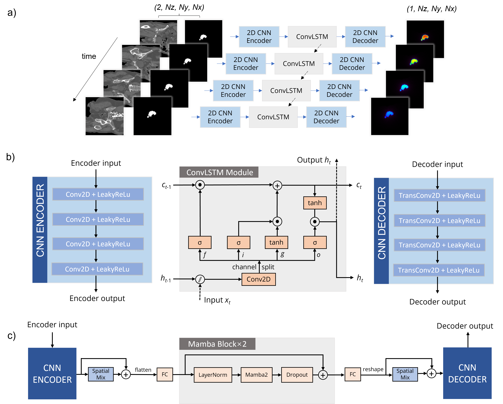

# Multi-model Study of Fast VMAT Segment Dose Calculation with Deep Learning

[](https://opensource.org/licenses/MIT)
[](docker/)
[](https://doi.org/10.1088/1361-6560/ae6413)

This repository contains the source code, model weights, and Dockerfile accompanying the paper:

> **Multi-model study of fast VMAT segment dose calculation with deep learning**
> Fan Xiao, Niklas Wahl, Claus Belka, Christopher Kurz, Georgios Dedes, Guillaume Landry
> *Physics in Medicine & Biology*, 2026. [https://doi.org/10.1088/1361-6560/ae6413](https://doi.org/10.1088/1361-6560/ae6413)

## Repository Contents
* **`docker/`**: Dockerfile for setting up a reproducible environment.
* **`preprocessing/`**: Scripts for BEV cuboid/patient coordinate (four physical inputs) processing.
* **`model/`**: Source code and weights for the CNN-ConvLSTM, CNN-Mamba, DoTA(pytorch), C3D, DeepDose-C3D.
* **`train/`**: Shared training utils (`utils.py`) and per-model entry points (`CNN_ConvLSTM/train.py`, `CNN_Mamba/train.py`).
* **`inference/`**: Shared inference pipeline (`pipeline.py`) and per-model entry points (`CNN_ConvLSTM/inference.py`, `CNN_Mamba/inference.py`).


## Model Architectures



## Inference

```bash
# CNN-ConvLSTM
python inference/CNN_ConvLSTM/inference.py \
    --patient PATIENT_ID \
    --sim-root /path/to/simulation \
    --seg-dir /path/to/segments \
    --ct-root /path/to/ct \
    --model-weights /path/to/weights.pth

# CNN-Mamba
python inference/CNN_Mamba/inference.py \
    --patient PATIENT_ID \
    --sim-root /path/to/simulation \
    --seg-dir /path/to/segments \
    --ct-root /path/to/ct \
    --model-weights /path/to/weights.pth
```

## Open Challenge

An associated open challenge is available at the [DoseRad 2026 Grand Challenge](https://doserad2026.grand-challenge.org/).

## Citation

If you find this code useful in your research, please consider citing: 

```bibtex
@article{xiao2026multimodel,
  title   = {Multi-model study of fast {VMAT} segment dose calculation with deep learning},
  author  = {Xiao, Fan and Wahl, Niklas and Belka, Claus and Kurz, Christopher and Dedes, Georgios and Landry, Guillaume},
  journal = {Physics in Medicine \& Biology},
  year    = {2026},
  doi     = {10.1088/1361-6560/ae6413}
}
```
